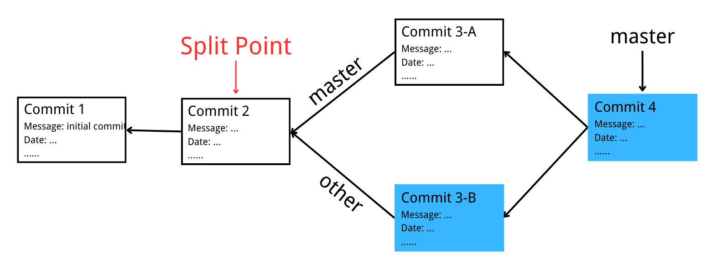

# Getlet

This is the design documentation of project [Gitlet](https://sp21.datastructur.es/materials/proj/proj2/proj2) in [CS61b](https://sp21.datastructur.es/)


## Before Start

You should make sure you are familiar with concepts below.

Real Git distinguishes several different kinds of objects. For our purposes, the important ones are

??? Blob
    The saved contents of files. Since Gitlet saves many versions of files, a single file might correspond to multiple blobs: each being tracked in a different commit.

??? Tree
    Directory structures mapping names to references to blobs and other trees (subdirectories).

??? Commit 
    Combinations of 

    - log messages
    - A reference to a tree
    - References to parent commits
    - Other metadata i.e. commit date, author, etc.
    
    The repository also maintains a mapping from branch heads to references to commits, so that certain important commits have symbolic names.

??? Git 
    You can refer to my [Git Notes](#) of [Introduction to Git and GitHub](https://www.coursera.org/learn/introduction-git-github) by Google for more information.

Below are the basic technical skill used in this project:

??? Serialize
    A Java object is converted into a stream of bytes during **serialization** to be saved in a file or transferred over the internet. The serialized stream of bytes is transformed back into the original object during **deserialization**.

    - `static <T extends Serializable> T readObject(File file, Class<T> expectedClass)`: reads in a serializable object from a file.
    - `static void writeObject(File file, Serializable obj)`: writes a serializable object to a file

??? IO
    There is a [Tutorial](https://www.tutorialspoint.com/java/java_files_io.htm) og IO operation in Java. 

## Structure

```
.gitlet
├─ HEAD
├─ objects
│  ├─ commit_1_id
│  ├─ commit_2_id
│  └─ ...
└─ ref
   └─ heads
      ├─ master
      └─ ...
```


## Classes and Data Structures


### Blob
#### Fields
```
private byte[] bytes;
private String id;
private String blobPath;
private File src;
private File blobSaveFileName;
```
Every blob object has its own saved contents of files. We get the file name and contents(byte array) from `src` and write the blob itself to file `blobSaveFileName`.

#### Useful Functions
- `static byte[] readContents(File file)`: reads in a file as a byte array
- `static File join(String first, String... others)`: joins together strings or files into a path.
- `static String sha1(Object... vals)`: In the case of blobs, “same content” means the same file contents. 

### Commit
#### Fields
```
private String message;
private String id;
private Date currentTime;
private String timestamp;
private List<String> parent;
private Map<String, String> blobRef;
private File commitSave;
```
**Remark**

- `id`: In the case of commits, it means the same metadata, the same mapping of names to references, and the same parent reference.
- `currentTime`: For initial commit, set its date `January 1, 1970, 00:00:00 GMT`. For following commits, get current time.
- `timestamp`: String generate from `currentTime`.
- `parent`: Use a list to store id of the last previous commit.
- `commitSave`: File get from commit `id`. We write commit object(deserializable) itself to this file.

#### Useful Functions
- `Date()`: Creates date object representing current date and time.
- `Date(long milliseconds)`: Creates a date object for the given `milliseconds` since January 1, 1970, 00:00:00 GMT.
- `SimpleDateFormat(String pattern)`: Constructs a SimpleDateFormat using the given `pattern` and the default date format symbols for the default `FORMAT` locale. Refer to [Javadoc](https://docs.oracle.com/javase%2F8%2Fdocs%2Fapi%2F%2F/java/text/SimpleDateFormat.html) for more information.


### Stage
#### Fields
```
private Map<String, String> blobRef = new HashMap<String, String>();
```
We implement a hash table storing reference of blob in add/remove stage. 
```
Key: path
Value: blob id
```

### Repository
#### Fields
```
public static final File CWD = new File(System.getProperty("user.dir"));
public static final File GITLET_DIR = join(CWD, ".gitlet");
public static final File OBJECT_DIR = join(GITLET_DIR, "objects");
public static final File REF_DIR = join(GITLET_DIR, "ref");
public static final File HEADS_DIR = join(REF_DIR, "heads");
public static final File HEAD_FILE = join(GITLET_DIR, "HEAD");
public static final File ADDSTAGE_FILE = join(GITLET_DIR, "add_stage");
public static final File REMOVESTAGE_FILE = join(GITLET_DIR, "remove_stage");
private static Commit commit; 
private static Stage addStage = new Stage();
private static Stage removeStage = new Stage();
```
**Remarks**

- `private static Commit commit` current commit.

## Commands

### `init`

- Creates a new Gitlet version-control system in the current directory. 
- This system will automatically start with one commit that contains no files and has the commit message `initial commit`.

### `add`

Adds a copy of the file as it currently exists to the staging area.

### `rm`
There are two cases:

- Unstage the file if it is currently staged for addition.
- If the file is tracked in the current commit, stage it for removal, remove the file from the working directory if the user has not already done so.
 
### `commit`

Here’s a picture of before-and-after commit after running following code:

```
add Blob4
rm Blob1
commit “add and rm”
```

=== "Before Commit"

    

=== "After Commit"

    


### `log`

- Starting at the current head commit, display information about each commit backwards along the commit tree until the initial commit.
- For merge commits (those that have two parent commits), only display first parent's information 

### `global-log`

- Displays information about all commits ever made
- The order of information does not matter.

### `find`

Prints out the ids of all commits that have the given commit message


### `status`

- Displays what branches currently exist, and marks the current branch with a `*`. 
- Displays what files have been staged for addition or removal.

### `checkout`

There are three cases:

- `java gitlet.Main checkout -- [file name]`
    - After `commit`, there is `f.txt` in the working directory. Call the `checkout` command to recover the file. 
    - If the file currently tracked by commit contains `filename`, write it to the working directory
    - If the file with the same name exists, overwrite it, if not, write it directly.

- `java gitlet.Main checkout [commit id] -- [file name]`
    - Takes the version of the file as it exists in the commit with the given `id`
    - Puts it in the working directory, overwriting the version of the file that’s already there if there is one.

- `java gitlet.Main checkout [branch name]`: switch to `[branch name]`

    Before checkout, HEAD points to the latest commit of the `master` branch. 
    
    After checkout `other`, HEAD points to the latest commit of the `other` branch, and all the files in the working directory will become blob files included in `Commit4-B`. Then this file update process has three cases:

    - Files tracked by both commit with same file name but different blobID (i.e. different content), the file in `Commit4-B` will replace the original file;
    - Files whose file names are only tracked by `Commit4-A`, then these files will be deleted directly.
    - Files whose file names are only tracked by `Commit4-B`, then these files will be written directly to the working directory. 
    
        - If a file with the same name is already in the working directory when writing directly, it means that a new 1.txt file was added to the working directory before checkout without committed.
        - In this situation, `gitlet` does not know whether to save the newly added file or take the file in `Commit4-B` and overwrite it, then, gitlet will report an error to avoid information loss.

    Change HEAD to point to `Commit4-B` and then clear the cache area.

    === "Before checkout"

        

    === "After checkout"

        


### `branch`

- Add a new file with `branchname` in `heads` dictionary, whose content is current `commitID`, without changing HEAD pointer.
- Only add a new branch.

### `rm-branch`

- Delete a branch by deleting `branchname` file in `heads` dictionary.
- Note that `branchname` should not be branch pointing by current `HEAD`.


### `reset`

- Checks out all the files tracked by the given commit. Set `HEAD` pointing to specific commit id before file operation like that in `checkout branch`.
- Clear cache area finally.


### `merge`

Merge `branchname` to the current branch. Firstly we need to find split point, then we merge files.

### Find Split Point

!!! Split Point
    The **split point** is a latest common ancestor of the current and given branch heads.

We can use BFS traverse the branch from back to front, using a hash map to store their depth and commit id until encounter initial commit.

Then we can get commit map of our current branch and target branch. Now, we traverse two commit map and iterately update our split id and length to find the split point id. 

### Merge Files

Firstly, we need to test two failure cases:

=== "Fast Forward"
    If split point commit is same with HEAD commit, which means `target branch` is in the same branch and forward than current branch, update HEAD to the head commit of `target branch`.

    

=== "Ancestor"
    If split point commit is same with commit in `target commit`, which indicates `master` is in the same branch and behind master branch, thus we do not need to perform merge operation, simply output `Given branch is an ancestor of the current branch.` 

    

Then, when we perform merge operation, there are eight cases. Note that in each figure blow, we assume commit with different color has a file `f.txt` with different content. A white commit does not have `f.txt`:

=== "1"

    Any files that have been 

    - modified in the given branch since the split point
    - not modified in the current branch since the split point should be changed to their versions in the given branch (checked out from the commit at the front of the given branch). 

    These files should then all be automatically staged. 
    
    


=== "2"

    Any files that 
    
    - have been modified in the current branch 
    - but not in the given branch since the split point 

    should stay as they are.

    

=== "3"

    - Any files that have been modified in both the current and given branch in the same way (i.e., both files now have the same content or were both removed) are left unchanged by the merge. 

    - If a file was removed from both the current and given branch, but a file of the same name is present in the working directory, it is left alone and continues to be absent (not tracked nor staged) in the merge.

    


=== "4"

    Any files that were not present at the split point and are present only in the current branch should remain as they are.

    

=== "5"

    Any files that were not present at the split point and are present only in the given branch should be checked out and staged.

    

=== "6"

    Any files present at the split point, unmodified in the current branch, and absent in the given branch should be removed (and untracked).

    

=== "7"

    Any files present at the split point, unmodified in the given branch, and absent in the current branch should remain absent.

    


=== "8"
    Any files modified in different ways in the current and given branches are in conflict. 
    
    “Modified in different ways” can mean that the contents of both are changed and different from other, or the contents of one are changed and the other file is deleted, or the file was absent at the split point and has different contents in the given and current branches. 
    
    In this case, replace the contents of the conflicted file with

    


## Reference

- [Gitlet Project Document](https://sp21.datastructur.es/materials/proj/proj2/proj2)