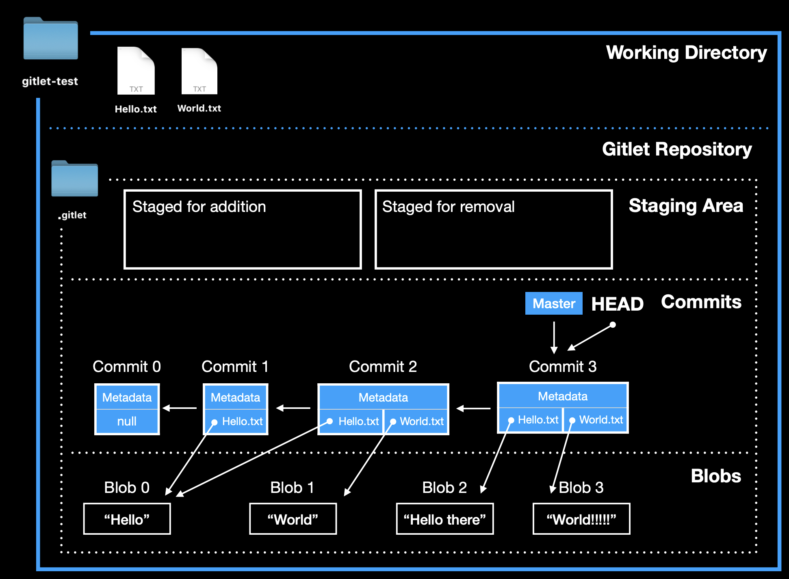

# Project

!!! note
    There are some projects I did during my study.

-   { width="300"; height="400" }

    ---

    Simulate a Git system and some of its command using basic data structure.

    [:octicons-arrow-right-24: More Details](Gitlet.md)

-   { width="300"; height="400"}

    ---

    New Project is on the way! 🔥

    [:octicons-arrow-right-24: More Details](#)

